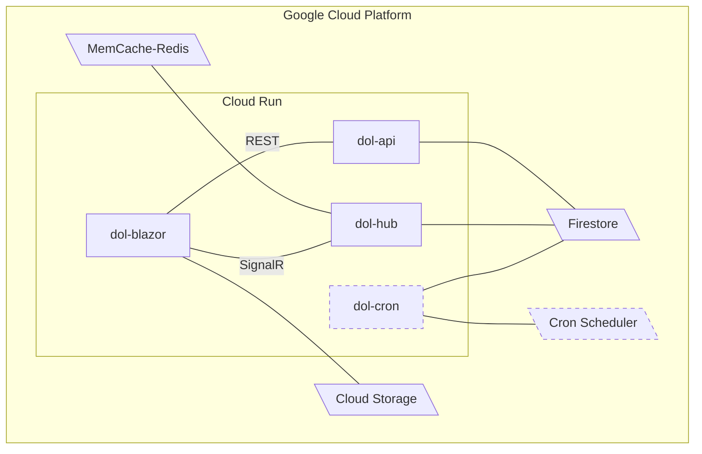

# Dominion of Light

This is the start of a great journey. The creation of Dominion of Light the game. This game is a Google Cloud hosted world. The first phase of the game is a web based app. As the game world evolves new features will be released to the app. The web app will be used to build out the SDK for future phases (Unity).

## Mission

Although this project may never get truly released but there are many other goals I wish to achieve with this project.

- __Unlimited game play__ - This is at the core of the games design
- Unlimited character building
  - Skill progression based on how you play not a point system
- Massive open world
  - Improbable to explore entirely
  - Persistence
  - Never exactly the same when revisiting
  - Evolving with AI based factions that govern everything even nature
- New quests all the time that evolve with the world
  - Minor quest opportunities everywhere
  - Full campaigns form automatically
  - No static story lines
- Tell the Dominion of Light story
  - This world has been designed, refactored, and grown for over 10 years.
  - It is my favorite creation
- Further improve cloud development skills
  - The game world will live in the cloud
  - Secure logins will be required for all users
  - Single API
  - Event driven workers for more intense processing
  - Possible use of AI to drive faction work loads

## How to play

### Web Site

Go to the [Web App](https://blazor-nlx462roma-uc.a.run.app). Then login and create a character.

### Get access

At this time I will only give access to a small group. Eventually I will grant access to larger groups as the releases become more feature rich and stable.

## Third Party Resources

- [.NET](https://dotnet.microsoft.com/en-us/learn/dotnet/what-is-dotnet)
- [C#](https://docs.microsoft.com/en-us/dotnet/csharp/tour-of-csharp/)
- [Google Cloud Platform](https://cloud.google.com/)
  - [Source Repositories](https://source.cloud.google.com/)
  - [Cloud Run](https://cloud.google.com/run)
  - [Firestore](https://cloud.google.com/firestore)
  - [Firebase Auth](https://firebase.google.com/products/auth)
  - [Firebase](https://firebase.google.com/)
- [Blazor](https://docs.microsoft.com/en-us/aspnet/core/blazor/?view=aspnetcore-6.0)
- [Rider](https://www.jetbrains.com/rider/)
- [GitHub](https://github.com/)
- [SignalR](https://dotnet.microsoft.com/en-us/apps/aspnet/signalr)
- [Bootstrap](https://getbootstrap.com/)
- [Azgaar's Fantasy Map Generator](https://azgaar.github.io/Fantasy-Map-Generator/)

## Road Map

The Road map included 3 phases. First the web app. This is a Blazor page app to help build out the SDK and cloud environment. Next will be a simple Unity based mobile game that will implement the SDK. The final phase may either be a Steam Greenlight project or an improved mobile game.

The following is the current road map subject to change.

| Feature                                                                                                                                                                                        | SDK                                                                                                                                     |
|------------------------------------------------------------------------------------------------------------------------------------------------------------------------------------------------|-----------------------------------------------------------------------------------------------------------------------------------------|
| ☁ __Web App__                                                                                                                                                                                  |                                                                                                                                         |
| ☁  |  |
| ☁   |                                                                                                                                         |
| ☁                |                                                                                                                                         |
| ☁                 |                                                                                                                                         |
| ☁                    |                                                                                                                                         |
| ☁                    |                                                                                                                                         |
| ☁                    |                                                                                                                                         |
| ☁                 |                                                                                                                                         |
| ☁                  |                                                                                                                                         |
| ☁                  |                                                                                                                                         |
| 📱 __Mobile App__                                                                                                                                                                              |                                                                                                                                         |
| 📱 Navigate the game world                                                                                                                                                                     |                                                                                                                                         |
| 📱 Encounters                                                                                                                                                                                  |                                                                                                                                         |
| 📱 Inventory                                                                                                                                                                                   |                                                                                                                                         |
| 📱 Combat                                                                                                                                                                                      |                                                                                                                                         |
| 📱 Skills                                                                                                                                                                                      |                                                                                                                                         |
| 📱 Quests                                                                                                                                                                                      |                                                                                                                                         |
| 📱 Campaigns                                                                                                                                                                                   |                                                                                                                                         |
| 📱 Factions                                                                                                                                                                                    |                                                                                                                                         |
| 📱 Property                                                                                                                                                                                    |                                                                                                                                         |
| 🎮 __Greenlight__                                                                                                                                                                              |                                                                                                                                         |
| 🎮 Navigate the game world                                                                                                                                                                     |                                                                                                                                         |
| 🎮 Encounters                                                                                                                                                                                  |                                                                                                                                         |
| 🎮 Inventory                                                                                                                                                                                   |                                                                                                                                         |
| 🎮 Combat                                                                                                                                                                                      |                                                                                                                                         |
| 🎮 Skills                                                                                                                                                                                      |                                                                                                                                         |
| 🎮 Quests                                                                                                                                                                                      |                                                                                                                                         |
| 🎮 Campaigns                                                                                                                                                                                   |                                                                                                                                         |
| 🎮 Factions                                                                                                                                                                                    |                                                                                                                                         |
| 🎮 Property                                                                                                                                                                                    |                                                                                                                                         |

## System Layout

Note: Dashed objects are not implemented yet

